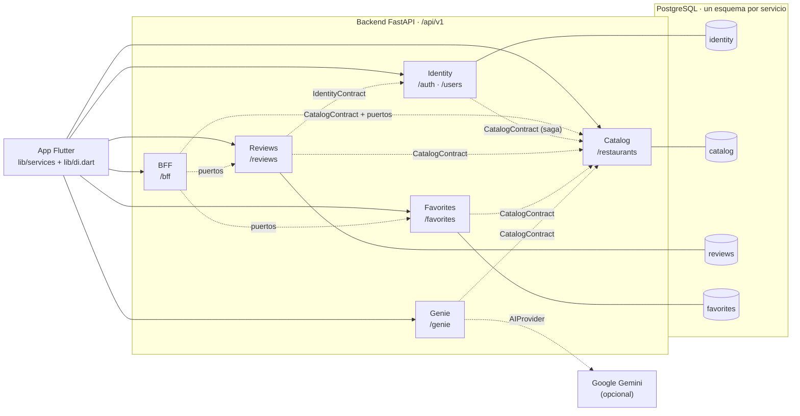
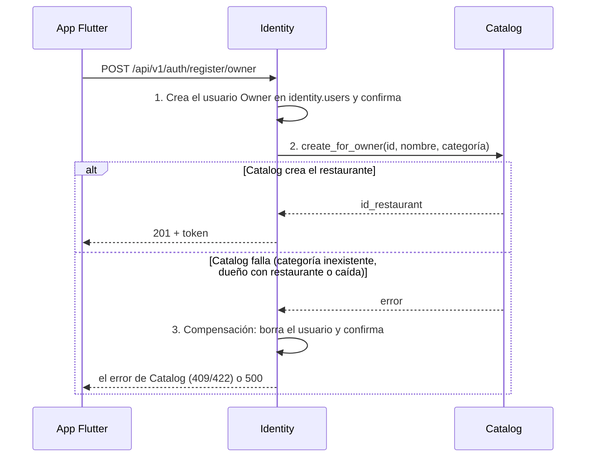

# Arquitectura orientada a servicios de Crave App

Este documento explica cómo Crave App aplica la arquitectura orientada a servicios (SOA): qué servicios hay, de quién es cada dato, cómo se comunican y dónde se ve cada principio en el código. Todos los enlaces apuntan a archivos del repositorio; una prueba ([`test_documentacion.py`](../backend/tests/contract/test_documentacion.py)) verifica que existan.

El plan de la migración está en la épica [#14](https://github.com/wame21/crave-app/issues/14).

## 1. Vista general



- Las flechas continuas son llamadas HTTP de la app a la API pública.
- Las punteadas son llamadas entre servicios, siempre a través de una interfaz:
  - un contrato de [`backend/contracts/`](../backend/contracts/), o
  - un puerto del BFF ([`bff/ports.py`](../backend/bff/ports.py)), o
  - un proveedor de IA ([`providers.py`](../backend/services/genie/providers.py)).
- Ningún servicio lee ni escribe las tablas de otro.

Cada servicio vive en `backend/services/<dominio>/` y se divide en las mismas capas:

| Capa | Responsabilidad | Ejemplo |
|---|---|---|
| `router.py` | Solo HTTP: rutas, `Depends`, `response_model` y errores documentados | [`services/catalog/router.py`](../backend/services/catalog/router.py) |
| `schemas.py` | Peticiones y respuestas (Pydantic) | [`services/reviews/schemas.py`](../backend/services/reviews/schemas.py) |
| `service.py` | Reglas de negocio, sin SQL ni HTTP | [`services/identity/service.py`](../backend/services/identity/service.py) |
| `repository.py` | SQL parametrizado sobre **su propio esquema** | [`services/favorites/repository.py`](../backend/services/favorites/repository.py) |
| `provider.py` | Implementación del contrato que el servicio ofrece | [`services/catalog/provider.py`](../backend/services/catalog/provider.py) |
| `tests/` | Pruebas unitarias del service con fakes e integración del router | [`services/reviews/tests/`](../backend/services/reviews/tests/) |

[`main.py`](../backend/main.py) descubre solo cada `services/*/router.py` y el [`bff/router.py`](../backend/bff/router.py), y los monta bajo `/api/v1`: agregar un servicio no obliga a editarlo.

## 2. Servicios y dueños de los datos

Patrón **una base de datos por servicio** dentro de una sola instancia de PostgreSQL: cada servicio es dueño de un esquema ([`db/init/01_schema.sql`](../db/init/01_schema.sql)). Entre esquemas **no hay claves foráneas**: las referencias a datos de otro servicio (`id_owner`, `id_client`, `id_restaurant`) son IDs lógicos que se validan con los contratos. Dentro de un mismo esquema sí puede haberlas, como la de las categorías en [`03_catalog_categories.sql`](../db/init/03_catalog_categories.sql).

| Servicio | Código | Esquema (dueño) | Implementa | Consume |
|---|---|---|---|---|
| Identity | [`services/identity/`](../backend/services/identity/) | `identity.users` | `IdentityContract` | `CatalogContract` (saga de registro de dueño) |
| Catalog | [`services/catalog/`](../backend/services/catalog/) | `catalog.restaurants`, `catalog.categories` | `CatalogContract` | — |
| Reviews | [`services/reviews/`](../backend/services/reviews/) | `reviews.reviews` | — | `CatalogContract`, `IdentityContract` |
| Favorites | [`services/favorites/`](../backend/services/favorites/) | `favorites.favorite_restaurants` | — | `CatalogContract` |
| Genie | [`services/genie/`](../backend/services/genie/) | — | — | `CatalogContract`, `AIProvider` |
| BFF | [`bff/`](../backend/bff/) | — | — | `CatalogContract` y sus puertos |

Cada repositorio tiene una prueba que comprueba que su SQL solo menciona su esquema; por ejemplo, [`services/reviews/tests/test_router.py`](../backend/services/reviews/tests/test_router.py) (`test_el_repositorio_no_toca_esquemas_ajenos`).

## 3. Contratos

### 3.1 Contrato público: la API v1

- **Publicado y versionado:** [`docs/contracts/openapi-v1.json`](contracts/openapi-v1.json).
  - Lo genera [`backend/scripts/export_openapi.py`](../backend/scripts/export_openapi.py), con las claves ordenadas para que los diffs sean estables.
  - [`test_openapi.py`](../backend/tests/contract/test_openapi.py) falla si la API cambia sin regenerarlo.
- **Verificado:** [`test_schemathesis.py`](../backend/tests/contract/test_schemathesis.py) genera peticiones a partir del OpenAPI y comprueba lo siguiente contra la app real:
  - Los códigos de estado documentados.
  - El esquema de cada respuesta.
  - Los `content-type`.
  - Que nunca haya un 500.

  Lo hace sin sesión y con la sesión de un cliente del seed.
- **Formato común**, definido una sola vez en [`backend/core/`](../backend/core/):
  - Errores `{"error": {"code", "message"}}` ([`errors.py`](../backend/core/errors.py)).
  - Paginación `Page[T]` con el `total` real ([`pagination.py`](../backend/core/pagination.py)).
  - JWT y roles con `require_role` ([`security.py`](../backend/core/security.py)).

### 3.2 Contratos entre servicios

Están en [`backend/contracts/`](../backend/contracts/) como `Protocol` de Python, con precondiciones, postcondiciones y errores documentados en cada método.

| Contrato | Métodos | Lo implementa | Lo usan |
|---|---|---|---|
| [`CatalogContract`](../backend/contracts/catalog.py) | `exists`, `get_summaries`, `list_active`, `create_for_owner`, `delete`, `set_rating` | [`CatalogProvider`](../backend/services/catalog/provider.py) | Identity, Reviews, Favorites, Genie, BFF |
| [`IdentityContract`](../backend/contracts/identity.py) | `get_public_profiles` | [`IdentityProvider`](../backend/services/identity/provider.py) | Reviews |

- **Inyección:** el servicio dueño registra su implementación con [`registry.py`](../backend/contracts/registry.py), y los consumidores la reciben con `Depends(get_catalog)`. No saben qué clase la implementa.
- **Pruebas:** en las pruebas se sustituye por [`FakeCatalog` y `FakeIdentity`](../backend/tests/fakes.py). [`services/catalog/tests/test_provider.py`](../backend/services/catalog/tests/test_provider.py) verifica, contra PostgreSQL, que la implementación real cumple lo mismo que el fake.
- **Transacciones:** cada llamada a un contrato usa su propia conexión y transacción ([`database.connection()`](../backend/database.py)). Es atómica y no participa en la transacción de quien llama.
- **Puertos del BFF:** el BFF no usa `contracts/` para lo que ese paquete no cubre. Para eso define puertos en [`bff/ports.py`](../backend/bff/ports.py), implementados en [`bff/adapters.py`](../backend/bff/adapters.py).

## 4. Saga de registro de dueño

Registrar a un dueño crea datos en dos servicios: el usuario en Identity y su restaurante en Catalog. Como no comparten transacción, se usa una **saga con compensación** ([`IdentityService.register_owner`](../backend/services/identity/service.py)):



- El usuario se confirma **antes** de llamar a Catalog, y el borrado se confirma por separado: cada paso es una transacción local.
- Si la compensación también falla, el error queda en el log y se responde el error original.
- **Pruebas:**
  - [`services/identity/tests/test_service.py`](../backend/services/identity/tests/test_service.py) con `FakeCatalog`, incluido el caso en que la compensación falla.
  - [`services/catalog/tests/test_router.py`](../backend/services/catalog/tests/test_router.py) de punta a punta con el Catalog real (`test_saga_de_registro_de_dueno_con_el_catalog_real`).

## 5. Principios SOA y evidencia en el código

| Principio | Cómo se aplica | Evidencia en el código |
|---|---|---|
| **Bajo acoplamiento** | Los servicios solo se conocen por interfaces, no hay claves foráneas entre esquemas y la app depende de interfaces, no de clases concretas. | [`contracts/`](../backend/contracts/), [`01_schema.sql`](../db/init/01_schema.sql), [`reviews/repository.py`](../backend/services/reviews/repository.py) (sin `catalog.` ni `identity.`), [`lib/di.dart`](../lib/di.dart) |
| **Alta cohesión** | Un servicio por dominio, cada uno con capas de una sola responsabilidad. Las pantallas se componen en el BFF y no en los servicios: `/restaurants/home` desapareció de Catalog. | [`services/`](../backend/services/), [`catalog/router.py`](../backend/services/catalog/router.py), [`bff/service.py`](../backend/bff/service.py) |
| **Reutilización** | Un solo kit de errores, paginación y seguridad para todos los servicios. El mismo DTO `RestaurantSummary` en listados, favoritos, el Genio y el BFF. Fakes compartidos en las pruebas. | [`core/`](../backend/core/), [`contracts/catalog.py`](../backend/contracts/catalog.py), [`tests/fakes.py`](../backend/tests/fakes.py), [`lib/services/api_client.dart`](../lib/services/api_client.dart) |
| **Contrato de servicio** | La API está versionada (`/api/v1`) y su OpenAPI se publica y se verifica con pruebas. Los contratos internos documentan precondiciones y postcondiciones. | [`openapi-v1.json`](contracts/openapi-v1.json), [`test_openapi.py`](../backend/tests/contract/test_openapi.py), [`test_schemathesis.py`](../backend/tests/contract/test_schemathesis.py), [`contracts/catalog.py`](../backend/contracts/catalog.py) |
| **Autonomía** | Cada servicio es dueño de su esquema y de sus transacciones. Reviews conserva la reseña aunque Catalog no responda, y el BFF responde con avisos si falla una parte. | [`database.py`](../backend/database.py), [`reviews/service.py`](../backend/services/reviews/service.py) (`_publish_rating`), [`bff/service.py`](../backend/bff/service.py) |
| **Abstracción** | Los consumidores ven `Protocol` y no implementaciones: contratos, puertos del BFF, `AIProvider` (Gemini o palabras clave) y servicios abstractos en Flutter. | [`contracts/registry.py`](../backend/contracts/registry.py), [`bff/ports.py`](../backend/bff/ports.py), [`genie/providers.py`](../backend/services/genie/providers.py), [`lib/services/restaurant_service.dart`](../lib/services/restaurant_service.dart) |
| **Composición** | El BFF arma Home y Detalle a partir de varios servicios. La saga compone Identity y Catalog, y el Genio compone Catalog con un proveedor de IA. | [`bff/service.py`](../backend/bff/service.py), [`identity/service.py`](../backend/services/identity/service.py), [`genie/service.py`](../backend/services/genie/service.py) |

## 6. Cómo verificarlo

```bash
docker compose up -d --wait                    # PostgreSQL con el seed
cd backend
pytest                                         # todas las pruebas del backend
pytest tests/contract                          # contrato publicado y schemathesis
python scripts/export_openapi.py --check       # el OpenAPI versionado está al día
cd .. && flutter test                          # la app
```
